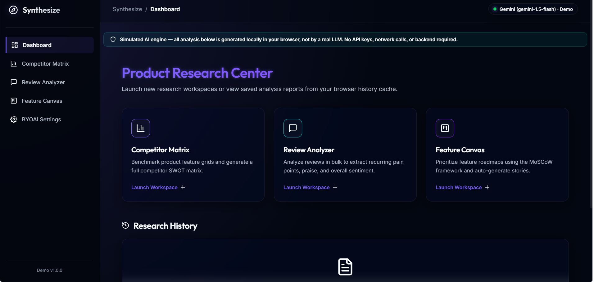
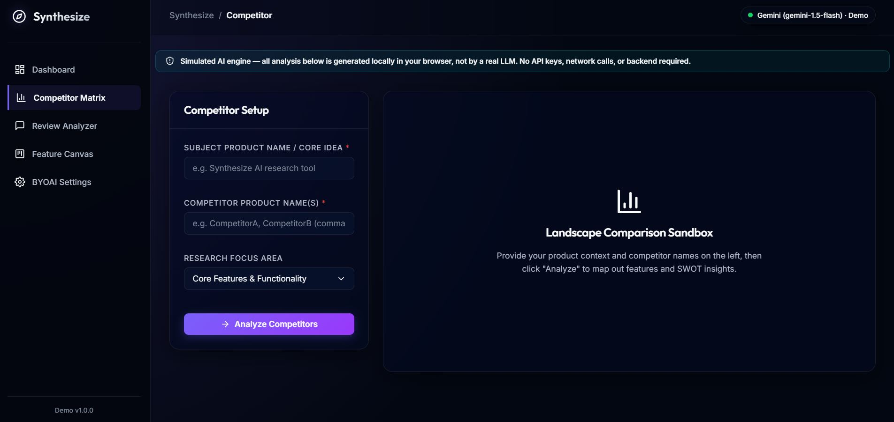
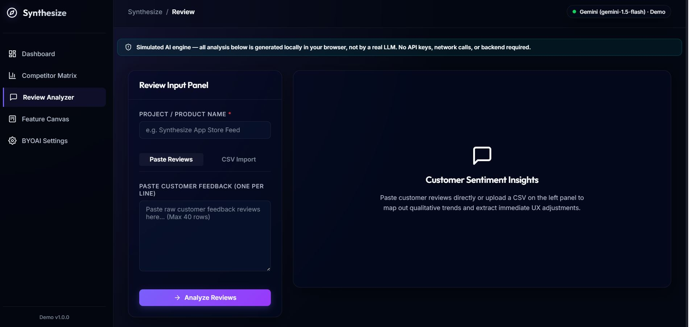
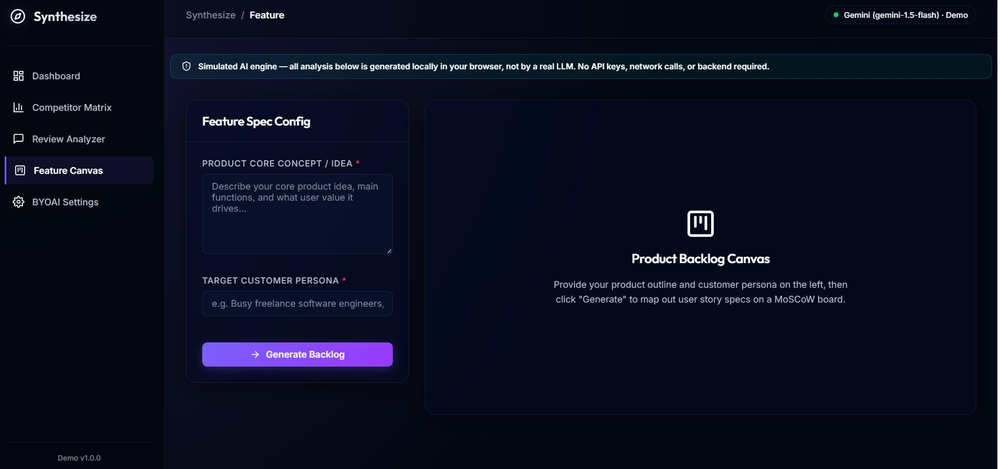

# AI Product Research Tool


A modern, client-side product research application that helps users analyze competitors, understand customer feedback, and prioritize product features through an intuitive AI-inspired interface.


> **Portfolio Project:** This project demonstrates frontend architecture, UI/UX design, and product research workflows using a simulated AI experience. No backend or external AI APIs are required.


---


## Features


- 📊 Interactive Dashboard with quick-launch tools

- 🏆 Competitor Matrix with benchmarking and SWOT analysis

- 💬 Review Analyzer with sentiment insights and feature requests

- 📋 Feature Canvas using MoSCoW prioritization

- 💾 Local history using browser localStorage

- 📤 Export reports as Markdown or JSON

- 📱 Responsive modern interface

- ⚡ Runs entirely in the browser


---


## Technologies Used


- HTML5

- CSS3

- JavaScript (ES6)

- React 18 (CDN)

- ReactDOM

- Browser LocalStorage

- FileReader API


---


# Screenshots


## Dashboard





---


## Competitor Matrix





---


## Review Analyzer





---


## Feature Canvas





---


## Getting Started


1. Download or clone this repository.

2. Open `index.html` in any modern web browser.

3. Start exploring the application.


---


## Project Structure


```

ai-product-research-tool/

│

├── index.html

├── README.md


└── screenshots/

    ├── dashboard.png

    ├── competitor-matrix.png

    ├── review-analyzer.png

    └── feature-canvas.png

```


---


## Notes


- This is a frontend portfolio demonstration.

- AI-generated outputs are simulated locally.

- No external AI services or API keys are used.

- User data is stored locally using browser localStorage.


---


## Future Improvements


- Real OpenAI/Gemini API integration

- Advanced CSV parsing

- Authentication

- Cloud storage

- Team collaboration

- PDF report export


---